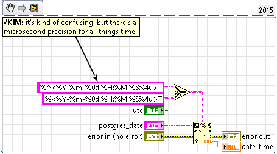
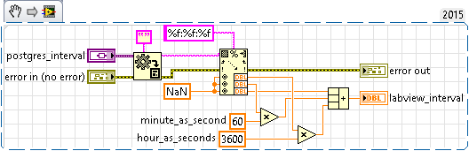
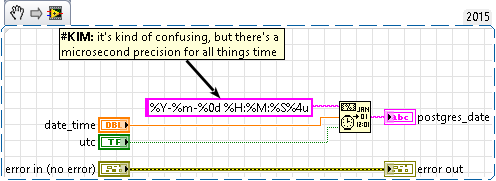
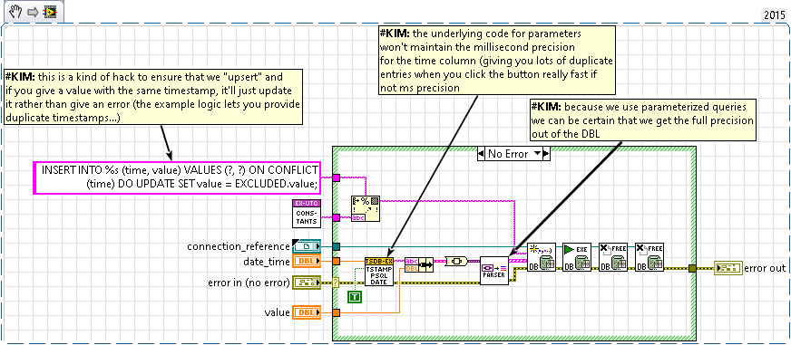
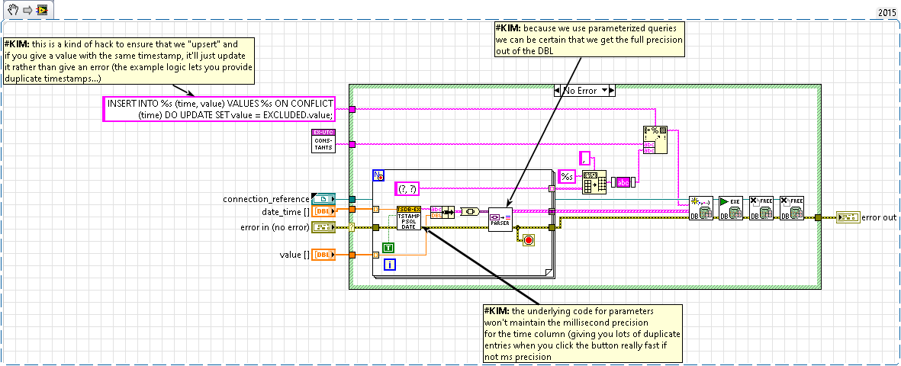
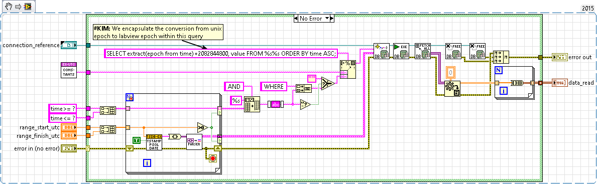
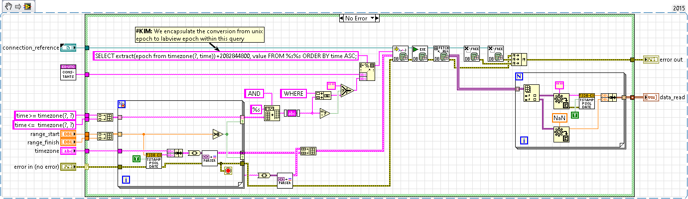

# lv-example-postgres (github.com/antonio-alexander/lv-example-postgres)

This is meant as an example for how to implement a timeseries "store" using timescaledb/postgres. It attempts to fill in the blanks in terms of implementation when using [lv-timescaledb](github.com/antonio-alexander/lv-timescaledb) library. I show how to add a single "row" of data and multiple.

This example doesn't require timescale, but if you're interested in using the timescale plugin, this is definitely a good place to start. It can be used as companion piece to the lv-timescaledb library to test and confirm functionality for admin functionality (e.g. working with chunks and policies). **This will work without the timescale plugin**

## Getting Started

lv-timescaledb-example is a collection of VIs that provide the minimum functionality to be able to read and write data. Although it's not a stretch to say that this is exactly what you'd need to get everything up and running, there are a couple of wrinkles (notable if you want to write multiple columns of data or different data types) that would require changing the schema slightly.

> None of the VIs are exported, do me the favor of being extra careful when you copy+pasta these VIs for your solution (that you really understand what they're doing)

In order to use this example, at a minimum you'll need to:

- Install the Postgres ODBC driver
- Run the included docker-compose OR install an instance of Postgres with the timescale plugin

In an attempt to have everything available in code, the following functionality is available in the example:

- Connecting to SQL
- Get Current time
- Create the timeseries table
- Perform timescale admin operations (creating the hypertable and enabling compression)
- Read data (all data and filtering for time range)
- Write data (single/multiple)
- Read data (with timezone conversion)

## Database Schema

Although I spend a lot of effort going through the trouble of putting together the schema from a UI, in practice you would **NEVER NEVER NEVER** do this; you'd have a sql file and/or do it manually in one offs. There's almost no reason to ever need to access the timescale API or the schema creation API from within an application. Administrative operations from within an application that's NOT an admin application is a kind of anti-pattern. Don't do it.

> DML (data manipulation language) statements within a non admin application, GOOD. DDL (data definition language) statements within a non admin application...BAD.

As is tradition, you may also want to store different values that could exist at the same time. My opinion is to use a wide schema and ensure that those values can be NULL. Although it's possible that you want to "add" more columns, adding data to an application doesn't happen often and if you allow nulls, you can just add a new column.

You can also put a lot (like a whole lot) of data in one table too. If you're not sure if your table is too big (then it isn't). And if it does become to big, you should: A) implement data retention/data archival, B) look into using different tablespaces/chunking (timescale supports this) or C) hire a DBA because you're in way over your head.

I've created a sample schema: [./source/sql/lv-example-postgres.sql](./source/sql/lv-example-postgres.sql). You can setup the schema manually with the following commands:

```sh
docker compose -f ./docker/docker-compose.yml up -d
docker cp postgres:/root/lv-example-postgres.sql ./source/sql/lv-example-postgres.sql
docker exec -it postgres /bin/ash
cd /root
psql --username=postgres -f ./lv-example-postgres.sql
```

Although [database normalization](https://en.wikipedia.org/wiki/Database_normalization) is ALWAYS in play, given the simple data (value/time) and the one dimensional relationship of data to time, there's not much more normalization to be done. This is probably a situation (normalization being unnecessary) specific to timeseries data.

## Timescale Postgres Plugin

This was built with the example in lv-timescale in mind. After the schema is setup (create table etc), you can use the example within lv-timescale to do different operations (to get to know the timescale plugin). Things to try:

- Try to create data that spans more than one chunk
- Try to compress chunks and write data to that chunk
- Try to compress chunks and read data from that chunk
- Try to de-compress chunks and read data from that chunk
- Try to set a compression policy and validate that it works
- Try to set a data retention policy and validate that it works

## Timestamps in LabVIEW/Postgres

Timestamps are probably the most complicated portion of all of this, LabVIEW's timestamp constant (or even when you're using a DBL) isn't **really** a primitive, it's an object. Even though it's always UTC under the hood, by default it'll automatically convert that time into the local timezone unless you use the UTC container for the display type (or your local timezone is GMT/UTC). As a result, we have to be careful when we convert postgres data into timestamps.

I try to maintain the following rules for timestamps in LabVIEW/postgres:

- Always write them at UTC
- Always offset timestamps within the postgres query
- DO NOT offset timestamps within LabVIEW

LabVIEW timestamps are different from Unix/Postgres timestamps, the epoch is...slightly different:

- LabVIEW epoch starts on 01/01/1904 00:00:00.00 UTC
- Unix epoch starts on 01/01/1970 00:00:00 UTC

To offset timestamps to/from LabVIEW/Postgres, you'll need to offset by 2082844800 (the difference between LabVIEW/Unix epoch).

Another hurdle you may reach is that if you use the database and connectivity toolkit to convert your timestamps to postgres variables/parameters, by default it won't maintain the timestamps precision (it'll truncate it to 1s) which is a problem if you have sub-second data. You can create your own timestamp/date string to maintain that precision. This is true even regardless of using a timestamp or DBL data type.

## Timezones in LabVIEW

LabVIEW (circa 2015), doesn't support any additional timezones at run time except for the local timezone OR UTC. **Generally** this isn't a problem unless you have a use case where you need to display in a timezone other than the local time zone (because you hate yourself?) or the time zone changes (do to location changes) without restarting the application. In order to "change" the runtime time zone to something other than local or UTC, you'll need to offset the timestamp by the timezone offset (this may also include magic for daylight savings time) or request the appropriate timezone from UTC. My suggestion is to NOT do this in LabVIEW, do this in postgres as a part of the queries and always "display" time as UTC.

The magic is that if you always store at UTC, you don't have to "worry" about the time since it's always..right. IF you store as UTC, then the data is always "correct", you just need to cast it into the timezone you want to "display" it as by offsetting (Postgres can do a much better job than LabVIEW/you could, trust me).

> Generally, write UTC, read in whatever timezone you want

## Postgres Data Covnersion in LabVIEW

Most of the database operations are really fast, like smoking. Under the hood LabVIEW uses [https://en.wikipedia.org/wiki/ActiveX_Data_Objects](https://en.wikipedia.org/wiki/ActiveX_Data_Objects) and when data is returned as a variant, it's in it's binary form. Generally, you'll lose ALL of your time doing conversion on the way out (and to a degree on the way in). I think that in general, if you DON'T convert everything to a string first and convert but rather convert directly from variant to the expected data types (and you stick to Fucking primitives), conversion won't add too much time to the clock.

## Post Installer

The post installer provides a proof of concept that can be used to install (or uninstall) the Postgres ODBC driver. It uses the [post-installer](https://github.com/antonio-alexander/lv-post-installer) library and interface. This attempst to solve the necessary problem of the needed application dependenies for the example.

## Postgres Queries

The API for all of the timeseries read/write operations follow what I think are best practices:

- Where possible always use parameterized queries (this will protect you from sql injection, esp if you use user supplied strings)
- Any input for time must be string since the Database & Connectivity Toolkit doesn't maintain precision for timestamps (you'll get time precision up to the minute, not millisecond)
- Table/schema names are generally constants (uses functional global), so is safe to use format into string (less possibility for sql injection)
- When converting from the 2D variant array (your rows) DO NOT DO NOT DO NOT convert it to a 2D array of string, the variant is already in its binary representation and it's cheaper to perform piecemeal conversion
- The database connection refnum isn't modified, so no need to pass it through any of the API
- All operations clean up after themselves and DO NOT chain the errors so the Closes always succeed (avoids memory leaks)
- Any simple conversion operations that don't involve LabVIEW data types should be done via query (it's almost always cheaper/faster)

### postgres_date_to_timestamp.vi



This vi performs conversion from a postgres date to utc timestamp; note that there is microsecond precision and the different absolute time containers depending on whether utc is true or not. Although there's "less" precision with a double rather than a timestamp, the double is more functional IMO.

### postgres_interval_to_double.vi



This converts a postgres interval to a relative time (in seconds). This only has a second resolution, but OK for this use case.

### timestamp_to_postgres_date.vi



This converts a given time in double form, to a postgres date/time string. This is preferable over using the "DB Tools Parser.vi" since it doesn't allow microsecond precision.

### insert_single.vi



This is a proof of concept to write a single "row" of data, one timestamp and one value.

```sql
INSERT INTO timeseries (time, value) VALUES (?, ?) ON CONFLICT (time) DO UPDATE SET value = EXCLUDED.value;
```

The question marks are time and value respectively, the ON CONFLICT ensures that if there's a conflict on time, we just replace the value. In practice, this should never matter, but it'll ensure that you don't get a SQL error. **Remove this at your discretion.**

### insert_multiple.vi



This is a proof of concept to write multiple "rows" of data.

```sql
INSERT INTO timeseries (time, value) VALUES %s ON CONFLICT (time) DO UPDATE SET value = EXCLUDED.value;
```

**This is NOT optimized for scalability** If you attempt to use this with more than a couple hundred kilobytes (maybe even a couple of megabytes) it'll fail with some ambiguous error. In practice, you'd need to have some way to break this up into multiple queries to nto overload the payload size for a single query. Timestamp conversion is expensive when using a string, but could be optimized...probably..if you used parameters and epoch.

### select_data.vi



This is a proof of concept for reading data with optional time ranges

```sql
SELECT extract(epoch from time)+2082844800, value FROM timeseries WHERE time <= ? AND time <= ? ORDER BY time ASC;
```

This is pretty straight forward, it will query all the data from the timeseries table that's inclusive of a start time and an end time. The offset to the time ensures that the values provided to LabVIEW don't require an offset to be converted to LabVIEW epoch. The logic within the LabVIEW code will omit a portion of the entire WHERE clause altogether if the times provided are less or equal to 0. The ORDER BY isn't necessary, but if left up to the database, you may also find yourself having to sort the array as well (and its cheaper/faster to do it with postgres).

### select_data_timezone.vi



This is a proof of concept for reading data with optional time ranges AND the ability to convert the time's timezone

```sql
SELECT extract(epoch from timezone(?, time))+2082844800, value FROM timeseries WHERE time <= ? AND time <= ? ORDER BY time ASC;
```

This follows the same as the above, except it will convert the time from the database into a given timezone. This solves the problem of being able to show data in a different "display" timestamp while keeping the data essentially the same (since it's stored in UTC). Just remember that in using this you have to "dispaly" your timestamp with the UTC container and not the default local container.
